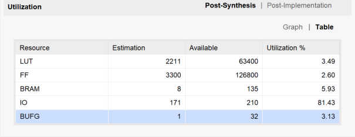
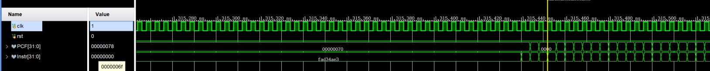

# Cache实验-实验报告

>   姓名：张劲暾
>
>   学号：PB16111485

## 实验设计

N路组相连Cache设计与说明：

```verilog
module cache #(
    parameter  LINE_ADDR_LEN = 3, // line内地址长度，决定了每个line具有2^3个word
    parameter  SET_ADDR_LEN  = 3, // 组地址长度，决定了一共有2^3=8组
    parameter  TAG_ADDR_LEN  = 6, // tag长度
    parameter  WAY_CNT       = 3  // 组相连度，决定了每组中有多少路line
)(
    input  clk, rst,
    output miss,               // 对CPU发出的miss信号
    input  [31:0] addr,        // 读写请求地址
    input  rd_req,             // 读请求信号
    output reg [31:0] rd_data, // 读出的数据，一次读一个word
    input  wr_req,             // 写请求信号
    input  [31:0] wr_data      // 要写入的数据，一次写一个word
);

localparam MEM_ADDR_LEN    = TAG_ADDR_LEN + SET_ADDR_LEN ; 
// 计算主存地址长度 MEM_ADDR_LEN，主存大小=2^MEM_ADDR_LEN个line
localparam UNUSED_ADDR_LEN = 32 - TAG_ADDR_LEN - SET_ADDR_LEN - LINE_ADDR_LEN - 2 ;
// 计算未使用的地址的长度

localparam LINE_SIZE       = 1 << LINE_ADDR_LEN  ;         
// 计算 line 中 word 的数量，即 2^LINE_ADDR_LEN 个word 每 line
localparam SET_SIZE        = 1 << SET_ADDR_LEN   ;         
// 计算一共有多少组，即 2^SET_ADDR_LEN 个组

//************************************************************************************
// SET_SIZE 个 set， 每个 set 有 WAY_CNT 个 line ，每个 line 有 LINE_SIZE 个 word
reg [            31:0] cache_mem    [SET_SIZE][WAY_CNT][LINE_SIZE];
// SET_SIZE 个 set， 每个 set 有 WAY_CNT 个 TAG
reg [TAG_ADDR_LEN-1:0] cache_tags   [SET_SIZE][WAY_CNT];
// SET_SIZE 个 set， 每个 set 有 WAY_CNT 个 valid(有效位)       
reg                    valid        [SET_SIZE][WAY_CNT];
// SET_SIZE 个 set， 每个 set 有 WAY_CNT 个 dirty(脏位)
reg                    dirty        [SET_SIZE][WAY_CNT];
//************************************************************************************

wire [              2-1 :0]   word_addr; 	// 将输入地址addr拆分成这5个部分
wire [  LINE_ADDR_LEN-1 :0]   line_addr;
wire [   SET_ADDR_LEN-1 :0]    set_addr;
wire [   TAG_ADDR_LEN-1 :0]    tag_addr;
wire [UNUSED_ADDR_LEN-1 :0] unused_addr;

enum  {IDLE, SWAP_OUT, SWAP_IN, SWAP_IN_OK} cache_stat;    
    // cache 状态机的状态定义                                             
    // IDLE       代表就绪，
    // SWAP_OUT   代表正在换出，
    // SWAP_IN    代表正在换入，
    // SWAP_IN_OK 代表换入后进行一周期的写入cache操作。

reg [   SET_ADDR_LEN-1 :0] mem_rd_set_addr = 0;
reg [   TAG_ADDR_LEN-1 :0] mem_rd_tag_addr = 0;
wire[   MEM_ADDR_LEN-1 :0] mem_rd_addr = {mem_rd_tag_addr, mem_rd_set_addr};
reg [   MEM_ADDR_LEN-1 :0] mem_wr_addr = 0;

reg  [31:0] mem_wr_line [LINE_SIZE];
wire [31:0] mem_rd_line [LINE_SIZE];

wire mem_gnt;      // 主存响应读写的握手信号

assign {unused_addr, tag_addr, set_addr, line_addr, word_addr} = addr;  
// 拆分 32bit ADDR

reg cache_hit = 1'b0;

//************************************************************************************
enum {FIFO, LRU} swap_out_strategy;

integer time_cnt;	// 全局时间戳

reg     [ WAY_CNT-1 : 0 ]   way_addr;   // 路地址
reg     [ WAY_CNT-1 : 0 ]   out_way;    // 扇出路

reg     [      15 : 0 ] LRU__record[SET_SIZE][WAY_CNT];
// LRU时间戳记录数组
reg     [ WAY_CNT : 0 ] FIFO_record[SET_SIZE][WAY_CNT];
// FIFO队列

always @ (*) begin              // 判断 输入的address 是否在 cache 中命中
// 如果 cache line有效，并且tag与输入地址中的tag相等，则命中
//--------------------------
    cache_hit = 1'b0;
    for(integer i = 0; i < WAY_CNT; i++) begin
        if( valid[set_addr][i] && cache_tags[set_addr][i] == tag_addr ) begin
            cache_hit = 1'b1;
            way_addr  = i;
        end
    end
//--------------------------
end
//************************************************************************************
// 组合逻辑在缺失时并行确定扇出路地址
always @(*) begin
    if( ~cache_hit & (wr_req | rd_req) ) begin
    //---------------------------------------------------------------------
        if( swap_out_strategy == LRU ) begin
        // LRU策略，换出时间戳最小的line
        //--------------------------------------------
            for(integer i = 0; i < WAY_CNT; i++) begin
                out_way = 0;
                if( LRU__record[set_addr][i] < LRU__record[set_addr][out_way])
                    out_way = i;
            end
        //--------------------------------------------
        end else begin
        //--------------------------------------------
        // FIFO策略
            integer free_available = 0;
            // 先寻找是否有还没用的line
            for(integer i = 0; i < WAY_CNT; i++) begin
                if( FIFO_record[set_addr][i] == 0 ) begin
                    out_way = i;
                    free_available = 1;
                    break;
                end
            end
            if(free_available == 0) begin
                // 已经没有尚未使用的line，就选择队尾line
                for(integer i = 0; i < WAY_CNT; i++) begin
                    if( FIFO_record[set_addr][i] == WAY_CNT ) begin
                        out_way = i;
                        break;
                    end
                end
            end
            //-----------------------------------
            // 所有已经被使用的line在队列中后移一位
            if( FIFO_record[set_addr][out_way] == 0) begin
                for(integer i = 0; i < WAY_CNT; i++) begin
                    if( FIFO_record[set_addr][i] != 0 ) begin
                        FIFO_record[set_addr][i] = FIFO_record[set_addr][i] + 1;
                    end
                end
            end
            //-----------------------------------
            FIFO_record[set_addr][out_way] = 1;
        //--------------------------------------------
        end
    end
end

always @ (posedge clk or posedge rst) begin     // ?? cache ???
    if(rst) begin
        cache_stat <= IDLE;
        time_cnt = 0;
    //------------------------------------
        // 在这里设置替换策略，这只是为了方便切换，资源统计时需要注释掉另一个策略对应的代码
        // swap_out_strategy <= FIFO;
        swap_out_strategy <= LRU;
    //------------------------------------
        for(integer i=0; i<SET_SIZE; i++) begin
//************************************************************************************
            for(integer j = 0; j < WAY_CNT; j++) begin
                dirty[i][j] = 1'b0;
                valid[i][j] = 1'b0;
                LRU__record[i][j] = 0;
                FIFO_record[i][j] = 0;
            end
//************************************************************************************
        end
        for(integer k=0; k<LINE_SIZE; k++)
            mem_wr_line[k] <= 0;
        mem_wr_addr <= 0;
        {mem_rd_tag_addr, mem_rd_set_addr} <= 0;
        rd_data <= 0;
    end else begin
        time_cnt++;
        case(cache_stat)
        IDLE:       begin
                        if( cache_hit ) begin
                            if(rd_req) begin 	// 如果cache命中，并且是读请求，
                            //--------------------------------------------------------
                                //则直接从cache中取出要读的数据
                                rd_data <= cache_mem[set_addr][way_addr][line_addr];   
                            end else if(wr_req) begin   // 如果cache命中，并且是写请求，
                                // 则直接向cache中写入数据
                                cache_mem[set_addr][way_addr][line_addr] <= wr_data;
                                // 写数据的同时置脏位  
                                dirty[set_addr][way_addr] <= 1'b1;                     
                            end 
                            LRU__record[set_addr][way_addr] <= time_cnt;
                            //--------------------------------------------------------
                        end else begin
                            if(wr_req | rd_req) begin   
                            // 如果 cache 未命中，并且有读写请求，则需要进行换入
                     //---------------------------------------------------------
                     // 如果要换入的 cache line 本来有效，且脏，则需要先将它换出
                     if( valid[set_addr][out_way] & dirty[set_addr][out_way] ) begin
                     	cache_stat  <= SWAP_OUT;
                     	mem_wr_addr <= { cache_tags[set_addr][out_way], set_addr };
                  		mem_wr_line <= cache_mem[set_addr][out_way];
                 	 // 反之，不需要换出，直接换入
                     end else begin                                   
                     	cache_stat  <= SWAP_IN;
                     end
                     {mem_rd_tag_addr, mem_rd_set_addr} <= {tag_addr, set_addr};
                     //---------------------------------------------------------
                            end
                        end
                    end
        SWAP_OUT:   begin
                        if(mem_gnt) begin           
                            // 如果主存握手信号有效，说明换出成功，跳到下一状态
                            cache_stat <= SWAP_IN;
                        end
                    end
        SWAP_IN:    begin
                        if(mem_gnt) begin           
                            // 如果主存握手信号有效，说明换入成功，跳到下一状态
                            cache_stat <= SWAP_IN_OK;
                        end
                    end
        SWAP_IN_OK:begin       
            // 上一个周期换入成功，这周期将主存读出的line写入cache，
            // 并更新tag，置高valid，置低dirty
                    //---------------------------------------------------------
            		for(integer i=0; i<LINE_SIZE; i++)  
                        cache_mem[mem_rd_set_addr][out_way][i] <= mem_rd_line[i];
                        cache_tags[mem_rd_set_addr][out_way] <= mem_rd_tag_addr;
                        valid     [mem_rd_set_addr][out_way] <= 1'b1;
                        dirty     [mem_rd_set_addr][out_way] <= 1'b0;
            			// 更新时间戳
                        LRU__record[mem_rd_set_addr][out_way] <= time_cnt;
                    //---------------------------------------------------------
                        cache_stat <= IDLE;        // 回到就绪状态
                   end
        endcase
    end
end

wire mem_rd_req = (cache_stat == SWAP_IN );
wire mem_wr_req = (cache_stat == SWAP_OUT);
wire [   MEM_ADDR_LEN-1 :0] mem_addr = 
    				mem_rd_req ? mem_rd_addr : ( mem_wr_req ? mem_wr_addr : 0);

assign miss = (rd_req | wr_req) & ~(cache_hit && cache_stat==IDLE) ;     
// 当有读写请求时，如果cache不处于就绪(IDLE)状态，或者未命中，则miss=1

main_mem #(     // 主存，每次读写以line 为单位
    .LINE_ADDR_LEN  ( LINE_ADDR_LEN          ),
    .ADDR_LEN       ( MEM_ADDR_LEN           )
) main_mem_instance (
    .clk            ( clk                    ),
    .rst            ( rst                    ),
    .gnt            ( mem_gnt                ),
    .addr           ( mem_addr               ),
    .rd_req         ( mem_rd_req             ),
    .rd_line        ( mem_rd_line            ),
    .wr_req         ( mem_wr_req             ),
    .wr_line        ( mem_wr_line            )
);

endmodule

```

## 性能分析

### LRU策略

截图示例，其他测试数据组织在表格中





| 设计思路 | benchmark | Cache size<br>(number of sets)\*<br>(way per set)\*<br>(word per line) | 组相连度 | 仿真时钟周期数 | 缺失率 |LUT|FF|IO|BRAM|BUFG|
| :--------: | :------: | :------------: | :----: | :--: | :--: | :--: | :--: | :--: | :--: | :--: |
| 原始设定 | MatMul.S<br>16 * 16 | 4\*4\*8 | 4 | 1315452/4 = **328863** | 4664/(3784 + 4664) = **0.552083** |2211|3300|171|8|1|
| 组相连度X2 | MatMul.S<br>16 * 16 | 4\*8\*8 | 8 | 1315452/4 = **328863** | 4664/(3784 + 4664) = **0.552083** |2177|3299|171|8|2|
| 组相连度X4 | MatMul.S<br/>16 * 16 | 4\*16\*8 | 16 | 1315452/4 = **328863** | 4664/(3784 + 4664) = **0.552083** |1983|3295|171|8|2|
| 组数X2 | MatMul.S<br>16 * 16 | 8\*4\*8 | 4 | 1311780/4 = **327945** | 4647/(4647 + 3801) = **0.550071** |2395|5545|171|8|2|
| 组数X4 | MatMul.S<br/>16 * 16 | 16\*4\*8 | 4 | 569468/4 = **142367** | 1317/(1317 + 7131) = **0.155895** |4508|10004|171|8|2|
| line字节数X2 | MatMul.S<br/>16 * 16 | 4\*4\*16 | 4 | 1274772/4 = **318693** | 4475/(4475 + 3973) = **0.529711** |3919|6108|171|8|2|
| line字节数X4 | MatMul.S<br/>16 * 16 | 4\*4\*32 | 4 | 600940/4 = **150235** | 1356/(1356 + 7092) = **0.160511** |8210|11730|171|8|2|
| 组数X4 + 组相连度X4 | MatMul.S<br/>16 * 16 | 16\*16\*8 | 16 | 569428/4 = **142357** | 1317/(1317 + 7130) = **0.155913** |7735|18002|171|8|2|
| 组数X4 + line字节数X4 | MatMul.S<br/>16 * 16 | 16\*4\*32 | 4 | 260440/4 = **65110** | 24/(24 + 8424) = **0.002841** |15645|36885|171|8|2|
| line字节数X4 + 组相连度X4 | MatMul.S<br/>16 * 16 | 4\*16\*32 | 16 | 600940/4 = **150235** | 1356/(1356 + 7092) = **0.160511** |6710|11746|171|8|2|
| 原始设定 | QuickSort.S<br/>256 | 4\*4\*8 | 4 | 246912/4 = **61728** |  225/(5242 + 225) = **0.041156**  |2211|3300|171|8|1|
| 组相连度X4 | QuickSort.S<br/>256 | 4\*16\*8 | 16 | 246912/4 = **61728** | 225/(5242 + 225) = **0.041156** |1983|3295|171|8|1|
| 组数X4 | QuickSort.S<br/>256 | 16\*4\*8 | 4 | 184332/4 = **46083** |   72/(72 + 5395) = **0.013170**   |4508|10004|171|8|2|
| line字节数X4 | QuickSort.S<br/>256 | 4\*4\*32 | 4 | 169580/4 = **42395** |   22/(22 + 5445) = **0.004024**   |8210|11730|171|8|2|
| 组数X4 + 组相连度X4 | QuickSort.S<br/>256 | 16\*16\*8 | 16 | 184332/4 = **46083** | 72/(72 + 5395) = **0.013170** |7735|18002|171|8|2|
| 组数X4 + line字节数X4 | QuickSort.S<br/>256 | 16\*4\*32 | 4 | 163652/4 = **40913** |    9/(9 + 5458) = **0.001646**    |15645|36885|171|8|2|
| line字节数X4 + 组相连度X4 | QuickSort.S<br/>256 | 4\*16\*32 | 16 | 169580/4 = **42395** | 22/(22 + 5445) = **0.004024** |6710|11746|171|8|2|

通过实验我们可以看到对于LRU策略:

1.  提高组相连度对于提升程序速度，降低缺失率作用非常有限，但是可以起到一点简化电路的作用
2.  增加组数和增加line内字数对于提升程序速度，降低缺失率有很大的作用，具体哪一种更好一点取决于应用(代码的特性)两者一起使用可以进一步优化访存效率，但是这两种方法会成比例增加电路面积，经济成本会有明显增加
3.  矩阵乘法代码的局部性比快排代码差很多，所以在增加Cache面积的时候表现出较大的优化比例

### FIFO策略

| 设计思路 | benchmark | Cache size<br>(number of sets)\*<br>(way per set)\*<br>(word per line) | 组相连度 | 仿真时钟周期数 | 缺失率 |LUT|FF|IO|BRAM|BUFG|
| :--------: | :------: | :------------: | :----: | :--: | :--: | :--: | :--: | :--: | :--: | :--: |
| 原始设定 | MatMul.S<br>16 * 16 | 4\*4\*8 | 4 | 1124932/4 = **281233** | 3781/(3781 + 4667) = **0.447561** |1103|2089|171|8|1|
| 组相连度X2 | MatMul.S<br>16 * 16 | 4\*8\*8 | 8 | 606324/4 = **151581**  | 1381/(1381 + 7067) = **0.163471** | 1103 | 2089  | 171  |8|1|
| 组相连度X4 | MatMul.S<br/>16 * 16 | 4\*16\*8 | 16 |  375208/4 = **93802**  |  434/(434 + 8014) = **0.051373**  | 859  | 2089  | 171  |8|1|
| 组数X2 | MatMul.S<br>16 * 16 | 8\*4\*8 | 4 | 615828/4 = **153957**  | 1425/(1425 + 7023) = **0.168679** | 1186 | 3145  | 171  |8|1|
| 组数X4 | MatMul.S<br/>16 * 16 | 16\*4\*8 | 4 |  390976/4 = **97744**  |  507/(507 + 7941) = **0.060014**  | 1968 | 5250  | 171  |8|1|
| line字节数X2 | MatMul.S<br/>16 * 16 | 4\*4\*16 | 4 | 635208/4 = **158802**  | 1515/(1515 + 6933) = **0.179332** | 2364 | 3879  | 171  |8|1|
| line字节数X4 | MatMul.S<br/>16 * 16 | 4\*4\*32 | 4 | 423592/4 = **105898**  |  658/(658 + 7790) = **0.077888**  | 3978 |7485|171|8|1|
| 组数X4 + 组相连度X4 | MatMul.S<br/>16 * 16 | 16\*16\*8 | 16 |  275992/4 = **68998**  |   96/(96 + 8352) = **0.011364**   | 1846 | 5247  | 171  |  8   |  1   |
| 组数X4 + line字节数X4 | MatMul.S<br/>16 * 16 | 16\*4\*32 | 4 |  260440/4 = **65110**  |   24/(24 + 8424) = **0.002841**   | 6856 | 19834 | 171  |  8   |  1   |
| line字节数X4 + 组相连度X4 | MatMul.S<br/>16 * 16 | 4\*16\*32 | 16 |  260440/4 = **65110**  |   24/(24 + 8424) = **0.002841**   | 4006 | 7467  | 171  |  8   |  1   |
| 原始设定 | QuickSort.S<br/>256 | 4\*4\*8 | 4 | 271892/4 = **67973** |  284/(284 + 5183) = **0.051948**  |1103|2089|171|8|1|
| 组相连度X4 | QuickSort.S<br/>256 | 4\*16\*8 | 16 | 170132/4 = **42533** | 39/(39 + 5428) = **0.007134** |859|2089|171|8|1|
| 组数X4 | QuickSort.S<br/>256 | 16\*4\*8 | 4 | 170132/4 = **42533** | 39/(39 + 5428) = **0.007134** |1968|5250|171|8|1|
| line字节数X4 | QuickSort.S<br/>256 | 4\*4\*32 | 4 | 163652/4 = **40913** | 9/(9 + 5458) = **0.001646** |3978|7485|171|8|1|
| 组数X4 + 组相连度X4 | QuickSort.S<br/>256 | 16\*16\*8 | 16 | 170132/4 = **42533** |   39/(39 + 5428) = **0.007134**   |1846|5247|171|8|1|
| 组数X4 + line字节数X4 | QuickSort.S<br/>256 | 16\*4\*32 | 4 | 163652/4 = **40913** | 9/(9 + 5458) = **0.001646** |6856|19834|171|8|2|
| line字节数X4 + 组相连度X4 | QuickSort.S<br/>256 | 4\*16\*32 | 16 | 163652/4 = **40913** | 9/(9 + 5458) = **0.001646** |4006|7467|171|8|1|

通过实验我们可以看到对于FIFO策略：

1.  访存优化效果：增加组相连度 > 增加组数 > 增加line内字数
2.  增加组相连度还是可以起到降低电路面积的作用
3.  三种方法配合使用可以进一步提高访存优化效果
4.  快排代码基本达到优化极限，进一步优化空间很小

### 总结

综上，我们看到FIFO策略的访存优化效果较好，采用组数X4 + 组相连度X4的方法即可以相当程度提高访存效率又可以控制电路面积相对较小，是比较合理的参数设定。