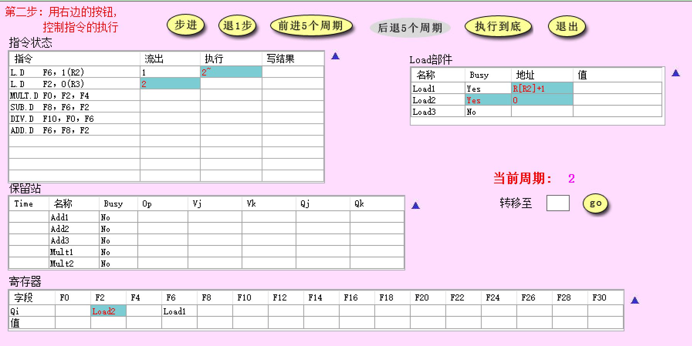
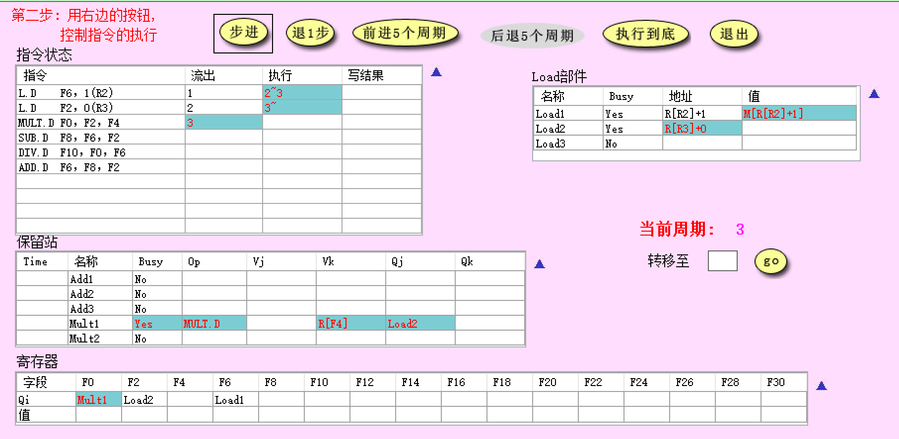
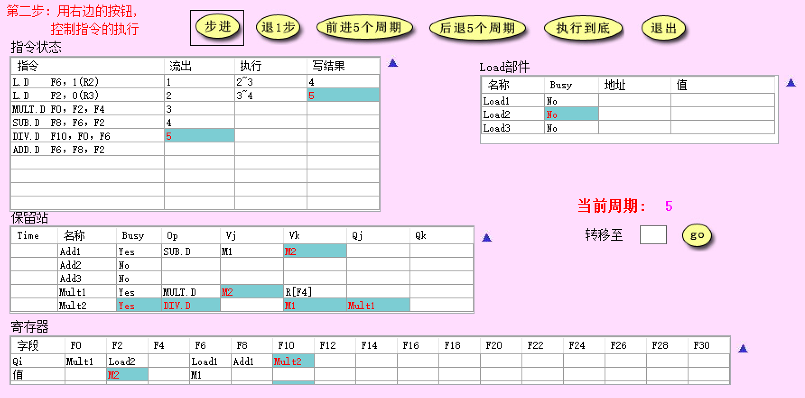
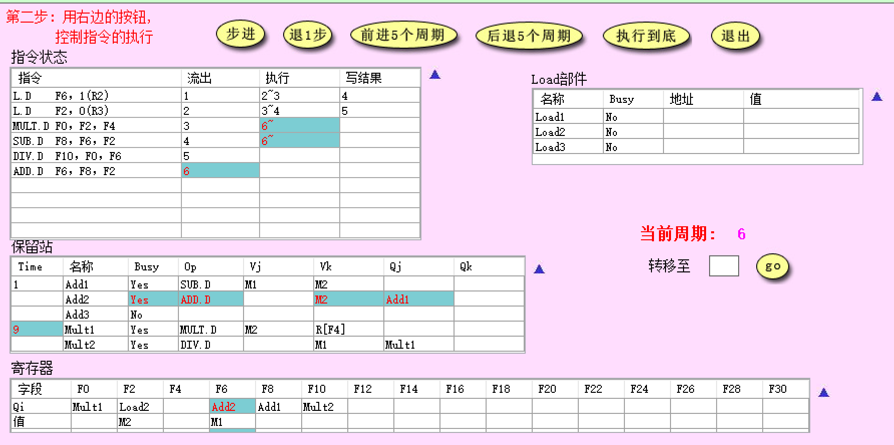
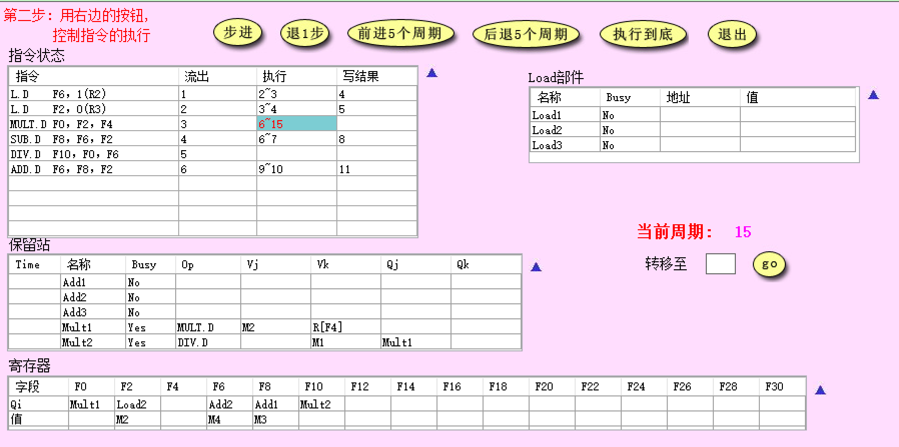
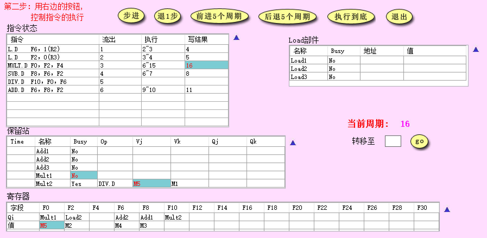
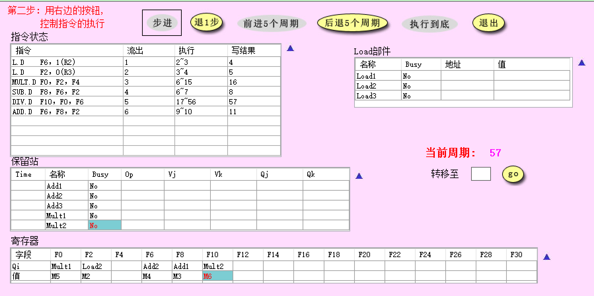
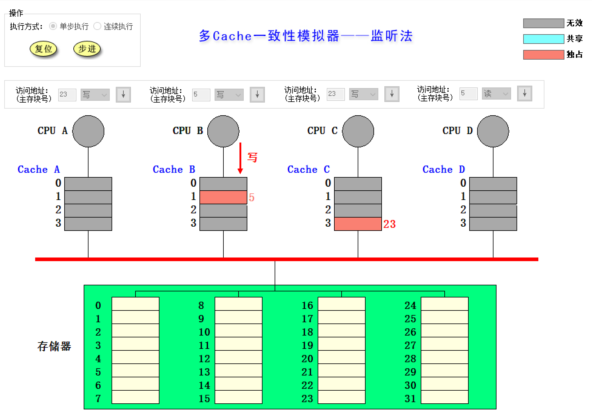
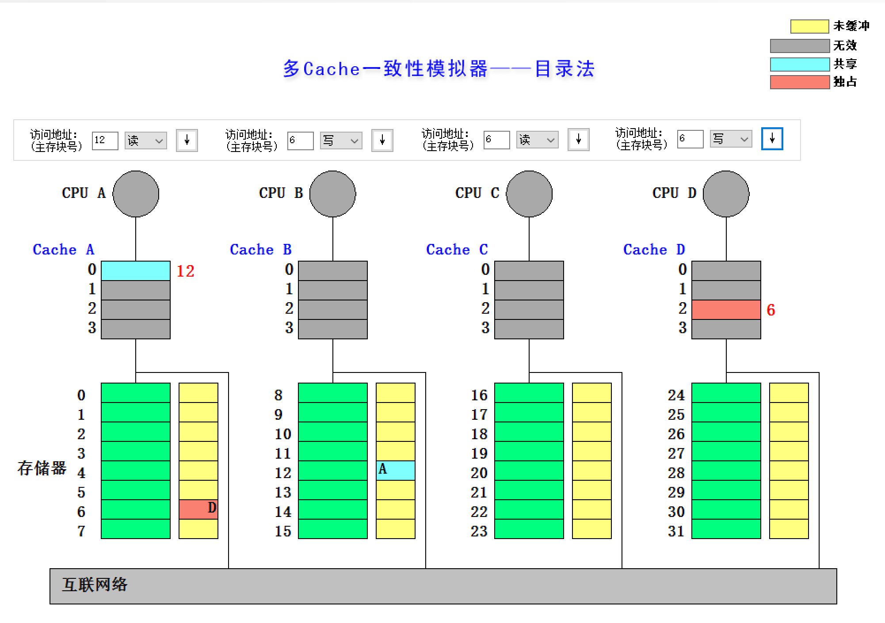

# Tomasulo和cache一致性模拟器使用-实验报告

>   姓名：张劲暾
>
>   学号：PB16111485

## Tomasulo算法模拟器

使用模拟器进行以下指令流的执行并对模拟器截图、回答问题

```assembly
L.D 	F6,  1(R2) 
L.D 	F2,  0(R3)		;这两行L.D也许有问题
MUL.D 	F0,  F2,    F4 
SUB.D 	F8,  F6,    F2 
DIV.D 	F10, F0,    F6
ADD.D 	F6,  F8,    F2
```

假设浮点功能部件的延迟时间：加减法2个周期，乘法10个周期，`load`/`store`2个周期，除法40个周期。

1.  分别截图(当前周期2和当前周期3)，请简要说明`load`部件做了什么改动

    周期2：占用Load2部件(Busy置位)，R2就绪则将地址保存在Load1部件地址寄存器

    

    周期3：Load1部件从存储器读到的值保存在Load1部件值寄存器，R3就绪则将地址保存在Load2部件地址寄存器

    

2.  请截图(`MUL.D`刚开始执行时系统状态)，并说明该周期相比上一周期整个系统发生了哪些改动(指令状态、保留站、寄存器和 Load 部件)

    周期5：(`MUL.D`开始执行的上一个周期)

    

    周期6：(`MUL.D`开始执行的第一个周期)

    

    系统发生的改变：

    -   指令状态：发射第6条指令，第3条指令和第4条指令同时进入执行状态
    -   Load部件：没有变化
    -   保留站：新发射的`ADD.D`指令占用Add2保留站，进入执行的`MUL.D`和`SUB.D`开始执行完成倒计时
    -   寄存器：新发射的`ADD.D`指令等待F6寄存器

3.  简要说明是什么相关导致`MUL.D`流出后没有立即执行

    源操作数F2未就绪(直到第5周期M2写入)

4.  请分别截图(15周期和16周期的系统状态)，并分析系统发生了哪些变化

    周期15：`ADD.D`和`SUB.D`在这十个周期内执行完毕，写回结果，释放相应的保留站和寄存器，`MUL.D`执行了10个周期

    

    周期16：`MUL.D`写回结果、释放保留站，CBD将结果广播到寄存器和`DIV.D`对应的保留站

    

5.  回答所有指令刚刚执行完毕时是第多少周期，同时请截图(最后一条指令写CBD时认为指令流执行结束)

    第57(16 + 40 + 1)周期:

    

## 多Cache一致性算法-监听法

利用模拟器进行下述操作，并填写下表

|   所进行的访问   | 是否发生了替换？ | 是否发生了写回？ | 监听协议进行的操作与块状态改变                               |
| :--------------: | :--------------: | :--------------: | ------------------------------------------------------------ |
| CPU A 读第 5  块 | 替换Cache A的块1 |        否        | Cache A发射Read Miss，<br>存储器传输第5块到Cache A，<br>Cache A的块1从**I**转换到**S** |
| CPU B 读第 5  块 | 替换Cache B的块1 |        否        | Cache B发射Read Miss，<br/>存储器传输第5块到Cache B，<br/>Cache B的块1从**I**转换到**S** |
| CPU C 读第 5  块 | 替换Cache C的块1 |        否        | Cache C发射Read Miss，<br/>存储器传输第5块到Cache C，<br/>Cache C的块1从**I**转换到**S** |
| CPU B 写第 5  块 |        否        |        否        | Cache B发射Invalidate，<br>Cache A的块1从**S**转换到**I**<br>Cache C的块1从**S**转换到**I**<br>Cache B的块1从**S**转换到**M** |
| CPU D 读第 5  块 | 替换Cache D的块1 | Cache B的块1写回 | Cache D发射Read Miss，<br>Cache B写回第5块，<br>存储器传输第5块到Cache D，<br>Cache B的块1从**M**转换到**S**<br>Cache D的块1从**I**转换到**S** |
| CPU B 写第 21 块 | 替换Cache B的块1 |        否        | Cache B发射Write Miss，<br/>存储器传输第21块到Cache B，<br/>Cache B的块1从**S**转换到**M** |
| CPU A 写第 23 块 | 替换Cache A的块3 |        否        | Cache A发射Write Miss，<br/>存储器传输第23块到Cache A，<br/>Cache A的块1从**I**转换到**M** |
| CPU C 写第 23 块 | 替换Cache C的块3 | Cache A的块3写回 | Cache C发射Write Miss，<br/>Cache A写回第23块，<br/>存储器传输第23块到Cache C，<br/>Cache A的块3从**M**转换到**I**<br>Cache C的块3从**I**转换到**M** |
| CPU B 读第 29 块 | 替换Cache B的块1 | Cache B的块1写回 | Cache B写回第21块，<br/>Cache B发射Read Miss，<br/>存储器传输第29块到Cache B，<br/>Cache B的块1从**M**转换到**S** |
| CPU B 写第 5  块 | 替换Cache B的块1 |        否        | Cache B发射Write Miss，<br/>存储器传输第5块到Cache B，<br/>Cache B的块1从**S**转换到**M**<br>Cache D的块1从**S**转换到**I** |

请截图，展示执行完以上操作后整个Cache系统的状态。



## 多Cache一致性算法-目录法

利用模拟器进行下述操作，并填写下表

|   所进行的访问   |                目录协议进行的操作与块状态改变                |
| :--------------: | :----------------------------------------------------------: |
| CPU A 读第 6  块 | Cache A发送Read Miss(A,6)到Memory A<br>Memory A传输第6块到Cache A<br>Cache A的块2从**I**转换到**S**<br>Memory A的块6, State:**U**->**S**，Presence bits:0000->0001<br>共享集合{A} |
| CPU B 读第 6  块 | Cache B发送Read Miss(B,6)到Memory A<br/>Memory A传输第6块到Cache B<br/>Cache B的块2从**I**转换到**S**<br/>Memory A的块6, State:**S**->**S**，Presence bits:0001->0011<br>共享集合{A，B} |
| CPU D 读第 6  块 | Cache D发送Read Miss(D,6)到Memory A<br/>Memory A传输第6块到Cache D<br/>Cache D的块2从**I**转换到**S**<br/>Memory A的块6, State:**S**->**S**，Presence bits:0011->1011<br/>共享集合{A，B，D} |
| CPU B 写第 6  块 | Cache B发送Write Hit(B,6)(Invalidate)到Memory A<br/>Memory A发送Invalidate(6)到Cache A<br>Cache A的块2从**S**转换到**I**<br>Memory A发送Invalidate(6)到Cache D<br>Cache D的块2从**S**转换到**I**<br>Cache B的块2从**S**转换到**M**<br>Memory A的块6, State:**S**->**M**，Presence bits:1011->0010<br/>共享集合{B} |
| CPU C 读第 6  块 | Cache C发送Read Miss(C,6)到Memory A<br/>Memory A发送Fetch(6)到Cache B<br/>Cache B传输第6块到Memory A<br/>Cache B的块2从**M**转换到**S**<br/>Memory A传输第6块到Cache C<br/>Cache C的块2从**I**转换到**S**<br/>Memory A的块6, State:**M**->**S**，Presence bits:0010->0110<br/>共享集合{B，C} |
| CPU D 写第 20 块 | Cache D发送Write Miss(D,20)到Memory C<br/>Memory C传输第20块到Cache D<br/>Cache D的块0从**I**转换到**M**<br/>Memory C的块20, State:**U**->**M**，Presence bits:0000->1000<br/>共享集合{D} |
| CPU A 写第 20 块 | Cache A发送Write Miss(A,20)到Memory C<br/>Memory C发送Fetch&Invalidate(20)到Cache D<br/>Cache D传输第20块到Memory C<br/>Cache D的块0从**M**转换到**I**<br/>Memory C传输第20块到Cache A<br/>Cache A的块0从**I**转换到**M**<br/>Memory C的块20, State:**M**->**M**，Presence bits:1000->0001<br/>共享集合{A} |
| CPU D 写第 6  块 | Cache D发送Write Miss(D,6)到Memory A<br/>Memory A发送Invalidate(6)到Cache B<br/>Cache B的块2从**S**转换到**I**<br/>Memory A发送Invalidate(6)到Cache C<br/>Cache C的块2从**S**转换到**I**<br/>Memory A传输第6块到Cache D<br/>Cache D的块2从**I**转换到**M**<br/>Memory A的块6, State:**S**->**M**，Presence bits:0110->1000<br/>共享集合{D} |
| CPU A 读第 12 块 | Cache A发送Write Back(A,20)到Memory C<br/>Cache A的块0从**M**转换到**I**<br/>Memory C的块20, State:**M**->**U**，Presence bits:0001->0000<br/>共享集合{}<br>Cache A发送Read Miss(A,12)到Memory B<br/>Memory B传输第12块到Cache A<br/>Cache A的块0从**I**转换到**S**<br/>Memory B的块12, State:**U**->**S**，Presence bits:0000->0001<br/>共享集合{A} |

请截图，展示执行完以上操作后整个Cache系统的状态。



## 综合问答

1.  目录法和监听法分别是集中式和基于总线，两者优劣是什么？(言之有理即可)

    监听法：

    优：保证了Cache一致性，实现了写互斥和写串行

    劣：

    	1. 总线上能够连接的处理器数目有限(扩展性差)
     	2. 总线竞争问题
     	3. 总线带宽带来的限制
     	4. 在非总线或环形网络上监听困难
     	5. 总线事务多，通信开销大

    目录法：

    优：

    	1. 可以连接的处理器数目更多，扩展性强
     	2. 降低了对于总线带宽的占用
     	3. 可以有效地适应交换网络进行通信

    劣：

    	1. 需要额外的存储空间存储Presence Bits，当处理器数目较多的时候会有很大的存储开销
     	2. 总线竞争
     	3. 存储器接口通信压力大，存储器速度成为限制

2.  Tomasulo算法相比Score Board算法有什么异同？

    (简要回答两点：1.分别解决了什么相关，2.分别是分布式还是集中式)(参考第五版教材)

    Tomasulo：分布式，指令状态、相关控制和操作数缓存分布在各个部件中(保留站RS)，

    1.  WAR:使用RS中的寄存器值或指向RS的指针代替指令中的寄存器(寄存器重命名)
    2.  WAW:使用RS中的寄存器值或指向RS的指针代替指令中的寄存器(寄存器重命名)
    3.  RAW:检测到没有冲突(寄存器就绪)再读取操作数，进入执行阶段
    4.  结构相关:有结构冲突不发射
    5.  结果Forward：从FU广播结果到RS和寄存器

    Score Board：集中式，指令状态和相关控制都在记分牌处理，解决了：

    	1. WAR:对操作排队，仅在读操作数阶段读寄存器
     	2. WAW:检测到相关后，停止发射前一条指令，直到前一条指令完成
     	3. RAW:检测到没有冲突(寄存器就绪)再读取操作数，进入执行阶段
     	4. 结构相关:有结构冲突不发射
     	5. 结果Forward：写回寄存器解除等待

3.  Tomasulo算法是如何解决结构、RAW、WAR和WAW相关的？(参考第五版教材)

    1.  结构相关:有结构冲突不发射
    2.  RAW：检测到没有冲突(寄存器就绪)再读取操作数，进入执行阶段
    3.  WAW：使用RS中的寄存器值或指向RS的指针代替指令中的寄存器(寄存器重命名)
    4.  WAR：使用RS中的寄存器值或指向RS的指针代替指令中的寄存器(寄存器重命名)

    


