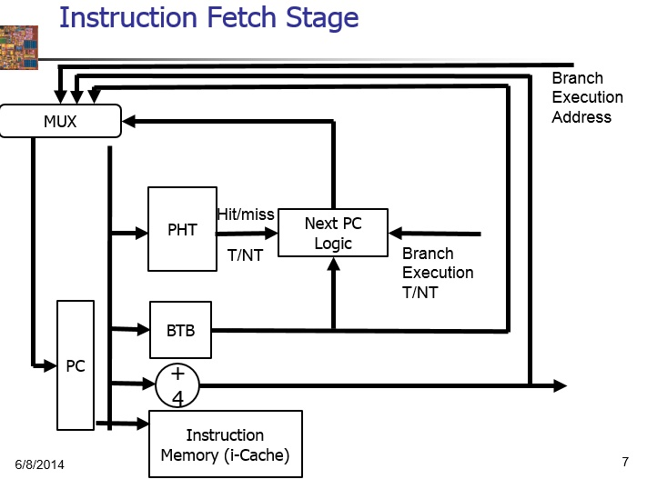
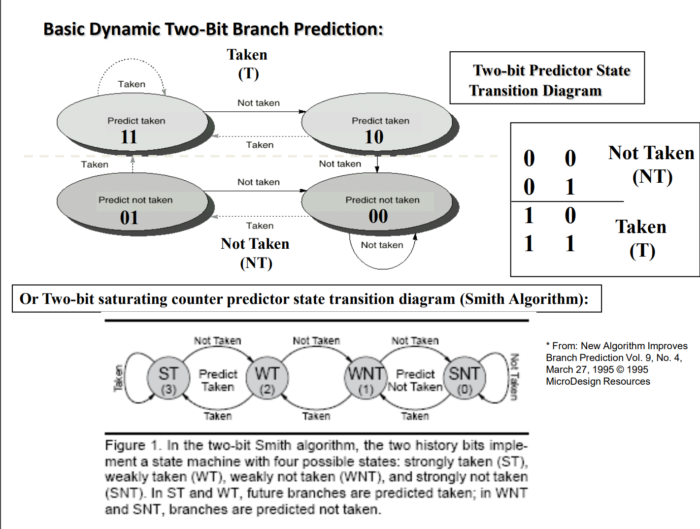

# 分支预测实验-实验报告

>   **姓名：张劲暾**
>
>   **学号：PB16111485**

## 实验背景补充

>   BTB中缓存了先前执行过的分支语句的指令地址BIA，分支跳转的地址BTA，以及分支预测的结果标识。取指令机构工作时，同时检索一级指令缓存和BTB，如果在BTB中找到有关条目的指令地址与当前要读取的指令相同，则按BTB中记录的BTA地址读取下一条指令送入管线中，同时继续执行分支指令，分支指令执行完毕后若结果与预测不符合，那么将刷新BTB的有关记录，并进行分支误预测的恢复操作。
>
>   指令预取队列中的指令按照管道方式(即先进先出)依次进入指令译码器，当译码时发现是一条分支指令，则检查BTB中有无该种分支指令的记录，若有，则立即按照所记录的目标地址进行预取(目标地址对应的指令及其后面的指令)，替代原先已进入指令预取队列中的指令。在这条指令执行完毕前夕，将该指令的实际目标地址再添入BTB中(当然，在预测正确时，目标地址不会变)，以使BTB中总保持最近遇到的分支指令及其目标地址。 
>
>   基于BTB和BHT的分支预测
>
>   1.  在取指阶段利用PC寻址BTB，如果命中，则说明这是一条跳转指令，利用从BTB中获取到的地址去取icache；
>   2.  由于BTB中保存的内容不够多，因此BHT的准确率更高，这个时候索引BHT表格，**如果发现BHT也跳转，则说明这条指令预测是跳转的；如果BHT不跳转，则说明不跳转，**这个时候就取消BTB中的指令地址，重新PC+4去取icache；
>
>   ---
>
>   1.  **B在取指阶段没有在BTB查询命中，并且实际分支结果是not taken**
>
>       **此时不更新BTB，仅仅更新BHT，**以及对应的模式历史表中的表项，按照2bit饱和计数器的状态机进行更新。
>
>   2.  **B在取指阶段没有在BTB查询命中，并且实际分支结果是taken**
>
>       此时更新BTB、BHT，其中BHT的更新内容同（1），对于BTB而言，需要在其中新增一个表项，其中存储指令B的地址与分支目标地址。
>
>   3.  **B在取指阶段在BTB查询命中，实际分支结果与预测结果不一致**
>
>       此时更新BTB、BHT，其中BHT的更新内容同（1），对于BTB而言，需要更新其中存储的指令B对应的目标地址。
>
>   4.  **B在取指阶段在BTB查询命中，实际分支结果与预测结果一致**
>
>       此时**不更新BTB，仅仅更新BHT**，更新内容同（1）。
>
>   ---

## 实验设计

## 实验结果与分析

### BTB(Branch Target Buffer)

指令：101 * 3 + 4 = 307 条

未使用分支预测的总周期数 = (17447 - 16431)/2 = 508 Cycle

使用分支预测的总周期数 = (17055 - 16431)/2 = 312 Cycle

命中98次，节省196个Cycle，完美

### BHT(Branch History Table)**(Smith Algorithm)**

>   **2-Bit Bimodal Prediction**
>
>   For each branch, maintain a 2-bit saturating counter:
>   if the branch is **taken: counter = min(3,counter+1)**
>   if the branch is **not taken: counter = max(0,counter-1)**
>
>   
>
>   

### BTB & BHT 预测逻辑真值表

| BTB  | BHT  | REAL 当前分支指令是否真正跳转 | NPC_PRED | flush | NPC_REAL | BTB update |
| :--: | :--: | :------------------------------: | :------: | :---: | :------: | :--------: |
|  Y   |  Y   |                Y                 |   BUF    |   N   |   BUF    |     N      |
|  Y   |  Y   |                N                 |   BUF    |   Y   | PC_EX+4  |     Y      |
|  Y   |  N   |                Y                 | PC_IF+4  |   Y   |   BUF    |     N      |
|  Y   |  N   |                N                 | PC_IF+4  |   N   | PC_EX+4  |     N      |
|  N   |  Y   |                Y                 | PC_IF+4  |   Y   |   BUF    |     Y      |
|  N   |  Y   |                N                 | PC_IF+4  |   N   | PC_EX+4  |     N      |
|  N   |  N   |                Y                 | PC_IF+4  |   Y   |   BUF    |     Y      |
|  N   |  N   |                N                 | PC_IF+4  |   N   | PC_EX+4  |     N      |

