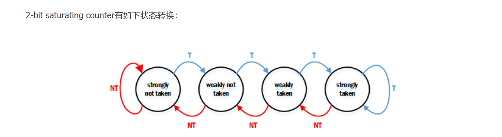

# 分支预测实验-实验报告

>   **姓名：张劲暾**
>
>   **学号：PB16111485**

---

## 目录

[TOC]

---

## 实验背景补充

>   BTB中缓存了先前执行过的分支语句的指令地址BIA，分支跳转的地址BTA，以及分支预测的结果标识。取指令机构工作时，同时检索一级指令缓存和BTB，如果在BTB中找到有关条目的指令地址与当前要读取的指令相同，则按BTB中记录的BTA地址读取下一条指令送入管线中，同时继续执行分支指令，分支指令执行完毕后若结果与预测不符合，那么将刷新BTB的有关记录，并进行分支误预测的恢复操作。
>
>   指令预取队列中的指令按照管道方式(即先进先出)依次进入指令译码器，当译码时发现是一条分支指令，则检查BTB中有无该种分支指令的记录，若有，则立即按照所记录的目标地址进行预取(目标地址对应的指令及其后面的指令)，替代原先已进入指令预取队列中的指令。在这条指令执行完毕前夕，将该指令的实际目标地址再添入BTB中(当然，在预测正确时，目标地址不会变)，以使BTB中总保持最近遇到的分支指令及其目标地址。 


## 实验设计

### BTB(btb.sv)

```verilog
module btb #(
    parameter ENTRY_NUM = 64    // BTB条目数量
)(
    input               clk,
    input               rst,
    input       [31:0]  PCF,
    input       [31:0]  PCE,
    input       [31:0]  BrNPC,
    input               BranchE,
    input       [6:0]   OpE,
    output  reg [31:0]  PredictedPC,    // 预测结果
    output  reg         PredictedF      // 预测结果有效
);
// 分支指令操作码
localparam BR_OP    = 7'b110_0011;
// Buffer
reg [31:0]  BranchInstrAddress[ ENTRY_NUM - 1 : 0 ];
reg [31:0]  BranchTargeAddress[ ENTRY_NUM - 1 : 0 ];
reg         Valid[ ENTRY_NUM - 1 : 0 ];

reg [15:0]  Tail;   // 采用FIFO的替换策略

// 组合逻辑产生预测跳转地址
always @(*/* posedge clk or posedge rst */) begin
    if( rst ) begin
        PredictedF  <= 1'b0;
        PredictedPC <= 32'b0;
    end else begin
        PredictedF  <= 1'b0;
        PredictedPC <= 32'b0;
        for(integer i = 0; i < ENTRY_NUM; i++) begin
            // if( EqualF[i] && Valid[i] ) begin
            if( (PCF == BranchInstrAddress[i]) && Valid[i] ) begin
                PredictedF  <= 1'b1;
                PredictedPC <= BranchTargeAddress[i];
            end
        end
    end
end
// Buffer更新
always @(posedge clk or posedge rst) begin
    if( rst ) begin
        for(integer i = 0; i < ENTRY_NUM; i++) begin
            Valid[i]                <= 1'b0;
            BranchInstrAddress[i]   <= 32'd0;
            BranchTargeAddress[i]   <= 32'd0;
        end
        Tail <= 16'd0;
    end else begin
        // EX段更新Buffer
        if( OpE == BR_OP ) begin
            integer i;
            for( i = 0; i < ENTRY_NUM; i++) begin
                if(PCE == BranchInstrAddress[i]) begin
                    BranchTargeAddress[i]   <= BrNPC;
                    Valid[i]                <= BranchE;
                    break;
                end
            end
            if( i == ENTRY_NUM ) begin
            // 如果队列中没有这一项
                BranchTargeAddress[Tail]    <= BrNPC;
                Valid[Tail]                 <= BranchE;
                BranchInstrAddress[Tail]    <= PCE;
                Tail                        <= Tail + 1;
            end
        end
    end
end

endmodule
```

#### 对应的修改：(*没有修改的部分用“...”省略*)

##### `EXSegReg.v`

```verilog
module EXSegReg(
    ...
    input wire [1:0] AluSrc2D,
//------------------------------------------
    output reg [1:0] AluSrc2E,
    input wire [6:0] Op,
    output reg [6:0] OpE,
    input wire PredictedD,
    output reg PredictedE
//------------------------------------------
    );
    initial begin
        ...
        AluSrc2E    = 2'b0;
//------------------------------------------
        PredictedE  = 1'b0;
        OpE         = 7'b0;  
//------------------------------------------
    end
    //
    always@(posedge clk) begin
        if(en)
            if(clear)
                begin
                PCE         <= 32'b0; 
                ...
                AluSrc2E    <= 2'b0;
        //------------------------------------------
                PredictedE  <= 1'b0;
                OpE         <= 7'b0;
        //------------------------------------------  
            end else begin
                PCE         <= PCD; 
                ...
                AluSrc2E    <= AluSrc2D;
        //------------------------------------------
                PredictedE  <= PredictedD;
                OpE         <= Op;
        //------------------------------------------       
            end
        end
    
endmodule

```

##### `HarzardUnit.v`

```verilog
module HarzardUnit(
    input wire CpuRst, ICacheMiss, DCacheMiss, 
    input wire BranchE, JalrE, JalD,
//------------------------------------------
    input wire PredictedE,
//------------------------------------------
    input wire [4:0] Rs1D, Rs2D, Rs1E, Rs2E, RdE, RdM, RdW,
    ...
    output reg [1:0] Forward1E, Forward2E
    );
    //
    //Stall and Flush signals generate
    always @ (*)
        if(CpuRst)
            {StallF,FlushF,StallD,FlushD,StallE,FlushE,StallM,FlushM,StallW,FlushW} <= 10'b0101010101;
        ...
//-----------------------------------------------------------------------------------
        else if(BranchE & PredictedE)
            {StallF,FlushF,StallD,FlushD,StallE,FlushE,StallM,FlushM,StallW,FlushW} <= 10'b0000000000;
        else if(~BranchE & PredictedE)
            {StallF,FlushF,StallD,FlushD,StallE,FlushE,StallM,FlushM,StallW,FlushW} <= 10'b0001010000;
//-----------------------------------------------------------------------------------
        else if(BranchE | JalrE)
            {StallF,FlushF,StallD,FlushD,StallE,FlushE,StallM,FlushM,StallW,FlushW} <= 10'b0001010000;
        ...
    //Forward Register Source 1
    always@(*)begin
        ...
    end
    //Forward Register Source 2
    always@(*)begin
        ...
    end      
endmodule

```

##### `IDSegReg.v`

```verilog
module IDSegReg(
    ...
    input wire [31:0] PCF,
//------------------------------------------
    output reg [31:0] PCD,
    //
    input wire PredictedF,
    output reg PredictedD
//------------------------------------------
    );
//------------------------------------------
    initial PredictedD = 0;
    always@(posedge clk)
        PredictedD <= clear ? 0 : PredictedF;
//------------------------------------------
    ...
endmodule
```

##### `NPC_Generator.v`

```verilog
module NPC_Generator(
    ...
    output reg [31:0] PC_In,
//------------------------------------------
    input   [31:0]  PCE,
    input   [31:0]  PredictedPC,
    input           PredictedF,
    input           PredictedE  //
//------------------------------------------
    );
    always @(*)
    begin
    //------------------------------------------
        if(JalrE)
            PC_In <= JalrTarget;
        else if(BranchE & ~PredictedE)
            PC_In <= BranchTarget;
        else if(~BranchE & PredictedE)
            PC_In <= PCE + 4;
        else if(JalD)
            PC_In <= JalTarget;
        else if(PredictedF)
            PC_In <= PredictedPC;
        else
            PC_In <= PCF + 4;
    //------------------------------------------
    end
endmodule

```

##### `RV32Core.v`

```verilog
module RV32Core(
    ...
    );
	//wire values definitions
    ...
    wire [1:0] LoadedBytesSelect;
//------------------------------------------
    wire PredictedF;
    wire PredictedD;
    wire PredictedE;
    wire [31:0] PredictedPC;
    wire [6:0] OpE;
//------------------------------------------
    //wire values assignments
    ...

    //Module connections
    // ---------------------------------------------
    // PC-IF
    // ---------------------------------------------
    NPC_Generator NPC_Generator1(
        .PCF(PCF),
        ...
        .JalrE(JalrE),
//------------------------------------------
        .PCE(PCE),
        .PC_In(PC_In),
        .PredictedPC(PredictedPC),
        .PredictedF(PredictedF),
        .PredictedE(PredictedE)
//------------------------------------------
    );

    ...

    // ---------------------------------------------
    // ID stage
    // ---------------------------------------------
    IDSegReg IDSegReg1(
        .clk(CPU_CLK),
        ...
        .PCF(PCF),
//------------------------------------------
        .PCD(PCD),
        .PredictedF(PredictedF),
        .PredictedD(PredictedD)
//------------------------------------------
    );

    ...

    // ---------------------------------------------
    // EX stage
    // ---------------------------------------------
    EXSegReg EXSegReg1(
        .clk(CPU_CLK),
        ...
        .AluSrc2D(AluSrc2D),
//------------------------------------------
        .AluSrc2E(AluSrc2E),
        .PredictedD(PredictedD),
        .PredictedE(PredictedE),
        .Op(OpCodeD),
        .OpE(OpE)
//------------------------------------------
    	); 
	...
    // ---------------------------------------------
    // Harzard Unit
    // ---------------------------------------------
    HarzardUnit HarzardUnit1(
        .CpuRst(CPU_RST),
        ...
        .Forward1E(Forward1E),
//------------------------------------------
        .Forward2E(Forward2E),
        .PredictedE(PredictedE)
//------------------------------------------
    	);
//------------------------------------------
    // ---------------------------------------------
    // btb Unit
    // ---------------------------------------------
    btb #(
        .ENTRY_NUM(64)
    ) btb1 (
        .clk(CPU_CLK),
        .rst(CPU_RST),
        .PCF(PCF),
        .PCE(PCE),
        .BrNPC(BrNPC),
        .BranchE(BranchE),
        .OpE(OpE),
        .PredictedPC(PredictedPC),
        .PredictedF(PredictedF)
    );
//------------------------------------------
endmodule
```

### BHT(bht.sv)

```verilog
module bht (
    input           clk,
    input           rst,
    input   [7:0]   tag,
    input   [7:0]   tagE,
    input           BranchE,
    input   [6:0]   OpE,
    output          PredictedF  // 预测结果有效
);
// 分支指令操作码
localparam BR_OP    = 7'b110_0011;

reg [1:0] Valid[ 255 : 0 ];

assign PredictedF = Valid[tag][1];

localparam STRONG_NT    = 2'b00;
localparam WEAKLY_NT    = 2'b01;
localparam WEAKLY_T     = 2'b10;
localparam STRONG_T     = 2'b11;

always @(posedge clk or posedge rst) begin
    if( rst ) begin
        for(integer i = 0; i < 256; i++) begin
            Valid[i] <= WEAKLY_NT;
        end
    end else begin
        if( OpE == BR_OP ) begin
            if(BranchE) begin   
Valid[tagE] <= ( Valid[tagE] == STRONG_T  ) ? STRONG_T  : Valid[tagE] + 2'b01;
            end else begin
Valid[tagE] <= ( Valid[tagE] == STRONG_NT ) ? STRONG_NT : Valid[tagE] - 2'b01;
            end
        end
    end
end

endmodule
```

#### 对应的修改：(*没有修改的部分用“...”省略*)

##### `btb.sv`

```verilog
module btb #(
    parameter ENTRY_NUM = 64    // BTB条目数量
)(
    input               clk,
    input               rst,
    input       [31:0]  PCF,
    input       [31:0]  PCE,
    input       [31:0]  BrNPC,
    input               BranchE,
    input       [6:0]   OpE,
    output  reg [31:0]  PredictedPC,        // 预测结果
    output  reg         PredictedPCValid    // BTB Buffer命中
);
// 分支指令操作码
localparam BR_OP    = 7'b110_0011;
// Buffer
reg [31:0]  BranchInstrAddress[ ENTRY_NUM - 1 : 0 ];
reg [31:0]  BranchTargeAddress[ ENTRY_NUM - 1 : 0 ];

reg [15:0]  Tail;   // 采用FIFO的替换策略

// 组合逻辑产生预测跳转地址
always @(*) begin
    if( rst ) begin
        PredictedPCValid <= 1'b0;
        PredictedPC      <= 32'b0;
    end else begin
        PredictedPCValid <= 1'b0;
        PredictedPC      <= 32'b0;
        for(integer i = 0; i < ENTRY_NUM; i++) begin
            if( PCF == BranchInstrAddress[i] ) begin
                PredictedPCValid <= 1'b1;
                PredictedPC      <= BranchTargeAddress[i];
            end
        end
    end
end
// Buffer更新
always @(posedge clk or posedge rst) begin
    if( rst ) begin
        for(integer i = 0; i < ENTRY_NUM; i++) begin
            BranchInstrAddress[i]   <= 32'd0;
            BranchTargeAddress[i]   <= 32'd0;
        end
        Tail <= 16'd0;
    end else begin
        // EX段更新Buffer
        if( OpE == BR_OP && BranchE ) begin
            integer i;
            for( i = 0; i < ENTRY_NUM; i++) begin
                if(PCE == BranchInstrAddress[i]) begin
                    break;
                end
            end
            if( i == ENTRY_NUM ) begin
            // 如果队列中没有这一项
                BranchTargeAddress[Tail]    <= BrNPC;
                BranchInstrAddress[Tail]    <= PCE;
                Tail                        <= Tail + 1;
            end
        end
    end
end

endmodule
```

##### `EXSegReg.v`

与BTB中相同

##### `HarzardUnit.v`

与BTB中相同

##### `IDSegReg.v`

与BTB中相同

##### `NPC_Generator.v`

```verilog
module NPC_Generator(
    ...
//------------------------------------------
    input   [31:0]  PCE,
    input   [31:0]  PredictedPC,
    input           PredictedPCValid,
    input           PredictedF,
    input           PredictedE  //
//------------------------------------------
    );
    always @(*)
    begin
    //------------------------------------------
        if(JalrE)
            PC_In <= JalrTarget;
        else if(BranchE & ~PredictedE)
            PC_In <= BranchTarget;
        else if(~BranchE & PredictedE)
            PC_In <= PCE + 4;
        else if(JalD)
            PC_In <= JalTarget;
        else if(PredictedF & PredictedPCValid)
            PC_In <= PredictedPC;
        else
            PC_In <= PCF + 4;
    //------------------------------------------
    end
endmodule

```

##### `RV32Core.v`

```verilog
module RV32Core(
    ...
    );
	//wire values definitions
    ...
    wire [1:0] LoadedBytesSelect;
//------------------------------------------
    wire PredictedF;
    wire PredictedD;
    wire PredictedE;
    wire PredictedPCValid;
    wire [31:0] PredictedPC;
    wire [6:0] OpE;
//------------------------------------------
    //wire values assignments
    ...
    //Module connections
    // ---------------------------------------------
    // PC-IF
    // ---------------------------------------------
    NPC_Generator NPC_Generator1(
        .PCF(PCF),
        ...
        .JalrE(JalrE),
//------------------------------------------
        .PCE(PCE),
        .PC_In(PC_In),
        .PredictedPC(PredictedPC),
        .PredictedPCValid(PredictedPCValid),
        .PredictedF(PredictedF),
        .PredictedE(PredictedE)
//------------------------------------------
    );
	...
    // ---------------------------------------------
    // ID stage
    // ---------------------------------------------
    IDSegReg IDSegReg1(
        .clk(CPU_CLK),
        ...
        .PCF(PCF),
//------------------------------------------
        .PCD(PCD),
        .PredictedF(PredictedF & PredictedPCValid),
        .PredictedD(PredictedD)
//------------------------------------------
    );
	...
    // ---------------------------------------------
    // EX stage
    // ---------------------------------------------
    EXSegReg EXSegReg1(
        .clk(CPU_CLK),
        ...
        .AluSrc2D(AluSrc2D),
//------------------------------------------
        .AluSrc2E(AluSrc2E),
        .PredictedD(PredictedD),
        .PredictedE(PredictedE),
        .Op(OpCodeD),
        .OpE(OpE)
//------------------------------------------
    	); 

   	...
    // ---------------------------------------------
    // Harzard Unit
    // ---------------------------------------------
    HarzardUnit HarzardUnit1(
        .CpuRst(CPU_RST),
        ...
        .Forward1E(Forward1E),
//------------------------------------------
        .Forward2E(Forward2E),
        .PredictedE(PredictedE)
//------------------------------------------
    	);
//------------------------------------------
    // ---------------------------------------------
    // btb Unit
    // ---------------------------------------------
    btb #(
        .ENTRY_NUM(64)
    ) btb1 (
        .clk(CPU_CLK),
        .rst(CPU_RST),
        .PCF(PCF),
        .PCE(PCE),
        .BrNPC(BrNPC),
        .BranchE(BranchE),
        .OpE(OpE),
        .PredictedPC(PredictedPC),
        .PredictedPCValid(PredictedPCValid)
    );
    // ---------------------------------------------
    // bht Unit
    // ---------------------------------------------
    bht bht1 (
        .clk(CPU_CLK),
        .rst(CPU_RST),
        .tag(PCF[9:2]),
        .tagE(PCE[9:2]),
        .BranchE(BranchE),
        .OpE(OpE),
        .PredictedF(PredictedF)
    );
//------------------------------------------
endmodule

```

## 实验结果与分析

### BTB(Branch Target Buffer)

分支收益和分支代价：预测准确收益2个Cycle，预测错误惩罚2个Cycle

指令：101 * 3 + 4 = 307 条

未使用分支预测的总周期数 = (17447 - 16431)/2 = 508 Cycle = 307 + 100 * 2 + 1（这一条是把波形图上出循环第一条算上了）

跳转指令101条，正确1次，错误100次

使用分支预测的总周期数 = (17055 - 16431)/2 = 312 Cycle = 307 + 2 * 2 + 1

跳转指令101条，正确99次，错误2次

多命中98次，节省196个Cycle

### BHT(Branch History Table)**(Smith Algorithm)**

>   **2-Bit Bimodal Prediction**
>
>   For each branch, maintain a 2-bit saturating counter:
>   if the branch is **taken: counter = min(3,counter+1)**
>   if the branch is **not taken: counter = max(0,counter-1)**
>
>   
>
>   

**从01启动，不是00**

分支收益和分支代价：预测准确收益2个Cycle，预测错误惩罚2个Cycle

指令：10 * (10 * 3 + 3) + 5 = 335 条

未使用分支预测的总周期数 = (17497 - 16431)/2 = 533 Cycle = 335 + 99 * 2

跳转指令110条，正确11次，错误99次

使用分支预测的总周期数 = (17153 - 16431)/2 = 361 Cycle = 335 + (11 + 2) * 2

跳转指令110条，正确 9 * 9 + 8 + 8 = 97次，错误13次

多命中 8 * 9 + 7 + 7 = 86次，节省172个Cycle

### 对比分析

分支收益和分支代价：流水段决定

未使用分支预测的总周期数 = 指令数 + 错误预测数 * 预测错误惩罚

使用分支预测的总周期数  = 指令数 + 错误预测数 * 预测错误惩罚

两者差值 = (未使用分支预测的错误预测数 - 使用分支预测的错误预测数) * 预测错误惩罚

未使用分支预测的错误预测数 = 跳转指令数 - 循环个数(最后一条)

BTB：使用分支预测的错误预测数 = 循环个数 * 2 (启动与退出)

BHT(**从01启动，不是00**)：使用分支预测的错误预测数 = 循环个数(最后一条) + 相同循环种数(启动)

### 整体CPI和加速比

#### BTB：

测试程序：

```assembly
.org 0x0
 	.global _start
_start:
    addi t0, zero, 0
    addi t1, zero, 0
    addi t2, zero, 101
for:
    add  t1, t1, t0
    addi t0, t0, 1
    bne  t0, t2, for
    addi t1, t1, 1

```

未使用分支预测的整体CPI = 533/335 = 1.6547231270358307

使用分支预测的整体CPI = 361/335 = 1.01628664495114

加速比：1.6547231270358307/1.01628664495114 = 1.6282051282051282 = 1.63

#### BHT：
测试程序：

```assembly
.org 0x0
 	.global _start
_start:
    addi t0, zero, 0    ;0
    addi t1, zero, 0    ;4
    addi t2, zero, 0    ;8
    addi t3, zero, 10   ;12
for_out: 
    addi t2, t2, 1      ;16
for_in:
    add  t1, t1, t0         ;20
    addi t0, t0, 1          ;24
    bne  t0, t3, for_in     ;28
    addi t0, zero, 0        ;32
    bne  t2, t3, for_out    ;36
    addi t1, t1, 1          ;40
```
未使用分支预测的整体CPI = 508/307 = 1.591044776119403

使用分支预测的整体CPI = 312/307 = 1.0776119402985074

加速比：1.591044776119403/1.0776119402985074 = 1.476454293628809 = 1.48

### BTB & BHT 预测逻辑真值表
>
>基于BTB和BHT的分支预测
>
>  1.  在取指阶段利用PC寻址BTB，如果命中，则说明这是一条跳转指令，利用从BTB中获取到的地址去取icache；
>  2.  由于BTB中保存的内容不够多，因此BHT的准确率更高，这个时候索引BHT表格，**如果发现BHT也跳转，则说明这条指令预测是跳转的；如果BHT不跳转，则说明不跳转，**这个时候就取消BTB中的指令地址，重新PC+4去取icache；
>
>---
>
> +   **B在取指阶段没有在BTB查询命中，并且实际分支结果是not taken**
>
>           **此时不更新BTB，仅仅更新BHT，**以及对应的模式历史表中的表项，按照2bit饱和计数器的状态机进行更新。
>
> +   **B在取指阶段没有在BTB查询命中，并且实际分支结果是taken**
>
>           此时更新BTB、BHT，其中BHT的更新内容同（1），对于BTB而言，需要在其中新增一个表项，其中存储指令B的地址与分支目标地址。
>
> +   **B在取指阶段在BTB查询命中，实际分支结果与预测结果不一致**
>
>           此时更新BTB、BHT，其中BHT的更新内容同（1），对于BTB而言，需要更新其中存储的指令B对应的目标地址。
>
> +   **B在取指阶段在BTB查询命中，实际分支结果与预测结果一致**
>
>           此时**不更新BTB，仅仅更新BHT**，更新内容同（1）。
>
>---
>

| BTB<br>**表示BTB的buffer是否命中** | BHT<br>**当前指令地址对应BHT中**<br>**是否是predict taken状态** | REAL<br>当前分支指令是否真正跳转 | NPC_PRED | flush | NPC_REAL |  BTB update   |
| :--------------------------------: | :----------------------------------------------------------: | :------------------------------: | :------: | :---: | :------: | :-----------: |
|                 Y                  |                              Y                               |                Y                 |   BUF    |   N   |   BUF    |       N       |
|                 Y                  |                              Y                               |                N                 |   BUF    |   Y   | PC_EX+4  |       N       |
|                 Y                  |                              N                               |                Y                 | PC_IF+4  |   Y   |   BUF    |       N       |
|                 Y                  |                              N                               |                N                 | PC_IF+4  |   N   | PC_EX+4  |       N       |
|                 N                  |                              Y                               |                Y                 | PC_IF+4  |   Y   |   BUF    | Y(加入新条目) |
|                 N                  |                              Y                               |                N                 | PC_IF+4  |   N   | PC_EX+4  |       N       |
|                 N                  |                              N                               |                Y                 | PC_IF+4  |   Y   |   BUF    | Y(加入新条目) |
|                 N                  |                              N                               |                N                 | PC_IF+4  |   N   | PC_EX+4  |       N       |

